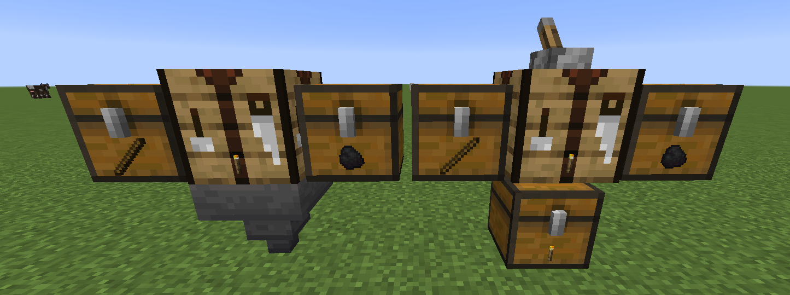

# 自動合成

## 指令列表
- `/autocraft add <群組>` 創建/添加箱子到 AutoCraft 群組
- `/autocraft remove <群組>` 刪除 AutoCraft 並將其物品丟在地板
- `/autocraft help` 命令列表及其用途
- `/autocraft list` 列出您擁有的所有 AutoCraft
- `/autocraft member [add/remove/list/add-to-all/remove-from-all]` 添加、移除或列出群組成員
- `/autocraft setpublic <群組> <true/false>` 設置 AutoCraft 為所有人可訪問
- `/autocraft rename <群組> <新名稱>` 重命名 AutoCraft

## 創建/添加
!!! info "注意"
    默認情況下，玩家最多可以創建3個自動合成。後續可以在 **暉幣商城** 購買更多
1. 手持 **告示牌**，輸入指令 `/autocraft add <群組>`

## 取消連結
1. 拆掉 **告示牌** 即可

## 刪除
1. 輸入指令 `/autocraft remove <群組>`