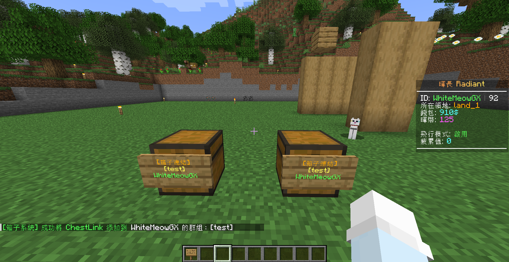

# 箱子連結
!!! 功能
    能夠將世界上的多個箱子連結在一起，以便從任何地方訪問

## 指令列表
- `/chestlink add <群組>` 創建/添加箱子到 ChestLink 群組
- `/chestlink remove <群組>` 刪除 ChestLink 並將其物品丟在地板
- `/chestlink menu <群組>` 打開 ChestLink 菜單顯示所有群組
- `/chestlink help` 命令列表及其用途
- `/chestlink list` 列出您擁有的所有 ChestLink
- `/chestlink member [add/remove/list/add-to-all/remove-from-all]` 添加、移除或列出群組成員
- `/chestlink setpublic <群組> <true/false>` 設置 ChestLink 為所有人可訪問
- `/chestlink rename <群組> <新名稱>` 重命名 ChestLink
- `/chestlink sort <群組> <排序選項>` 設置指定 ChestLink 的排序選項

## 創建/添加
!!! info "注意"
    默認情況下，玩家最多可以創建3個箱子連結。後續可以在 **暉幣商城** 購買更多
1. 手持 **告示牌**，輸入指令 `/chestlink add <群組>` 即可

## 取消連結
1. 拆掉 **告示牌** 即可

## 刪除
1. 輸入指令 `/chestlink remove <群組>` 即可

