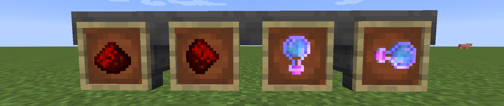

# 漏斗過濾

!!! info "介紹"
    漏斗可以套用過濾器，以便它們只接受或拒絕某些物品

    目前有四種類型的過濾器可以透過旋轉項目框架中的項目來啟用:
    1. **0° 預設** - 漏斗僅接受此項目（請注意，一個料斗上可以使用多個過濾器）
    2. **45° 拒絕模式** - 漏斗將阻止該物品被接受，但會接受其他物品
    3. **90° 類型接受** - 漏斗將接受相同類型的物品，例如**附魔書**、**附魔武器**、**藥水**、**木材**、**原木**、**柵欄**、**門**和許多其他類似物品組等
    4. **135° 類型拒絕** - 漏斗將拒絕上述過濾器中通常會接受的所有項目，因此類似類型將被拒絕
    

## 創建
1. 要為漏斗添加過濾器，您只需將一個物品框架放置在其頂部或任何側面，然後將要過濾的物品放入其中即可
### 範例

