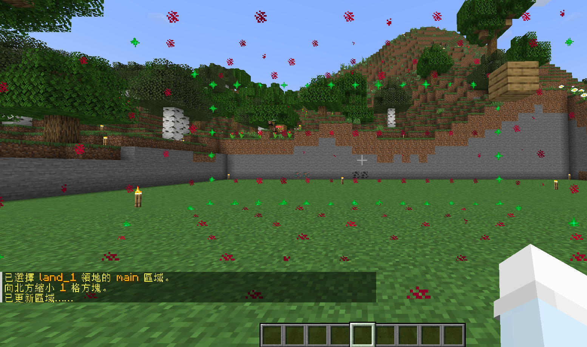

# 領地教學

!!! 註釋
    1. 區域像是一種領地裡的小土地，可以管理他人及自己的權限。例如您在家裡放置一個附魔台，設置 **使用權限**，就可以讓他人使用該方塊時無須信任。
    2. 領地的基本單位是使用 **每格方塊** 來計算

## 指令列表
- `/res create <領地名稱 (英文)>` 創建領地
- `/res remove <領地名稱>` 刪除領地
- `/res subzone <子區域名稱 (英文)>` 在領地上創建一個子區域。^^(必須是領地所有者才能執行此操作)^^
- `/res rename <舊名稱> <新名稱>` 在領地上重命名
- `/res set <權限> <true/false/remove>` 在領地上設置權限
- `/res pset <玩家名稱> <權限> <true/false/remove>` 在特定玩家下設置權限
- `/res padd <玩家名稱>` 將玩家加入至領地
- `/res pdel <玩家名稱>` 將玩家移除至領地
- `/res expand <數量>` 在領地上將您所站的方向擴大指定的數量
- `/res contract <數量>` 在領地上將您所站的方向縮小指定的數量
- `/res message <領地名稱> <enter/leave> <消息>` 設定進入或離開領地訊息
- `/res tpset` 在領地上設置傳送位置

## 創建領地
1. 準備一把 **金鋤**，手持 **金鋤** 對著地板點擊 ^^左鍵(第一點)^^，再點擊 ^^右鍵(第二點)^^

2. 第一點和第二點都設置後，輸入指令 `/res create <領地名稱 (英文)>`

## 領地權限
### 所有玩家
1. 進入領地範圍内，輸入指令 `/res set`

### 特定玩家
1. 進入領地範圍内，輸入指令 `/res pset <玩家名稱>`

## 玩家設定
### 加入玩家至領地
1. 進入領地範圍内，輸入指令 `/res padd <玩家名稱>`

### 移除玩家至領地
1. 進入領地範圍内，輸入指令 `/res pdel <玩家名稱>`

## 領地傳點設定
1. 進入領地範圍内，輸入指令 `/res tpset`

## 領地擴增 & 縮減
### 領地擴增
1. 進入領地範圍内，在你所站的方向，輸入指令 `/res expand <領地名稱> <擴增大小>`

### 領地縮減
1. 進入領地範圍内，在你所站的方向，輸入指令 `/res contract <領地名稱> <縮減大小>`

## 刪除領地
1. 進入領地範圍内，輸入指令 `/res remove`

2. 看到這段訊息后，輸入指令 `/res confirm`
