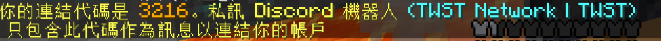

# 連接帳號

!!! 註釋
    本篇將會教您如何連接以及取消連接您的帳號

## 連接帳號
1. 打開聊天欄，輸入 `/discord link`
 

2. 記住上面的四位數字代碼，然後加入我們的  [**^^Discord 社群^^**](https://discord.twstgaming.xyz)

3. 進入 `伺服器設定` -> 點擊 `隱私設定`
 

4. 確定私人訊息為開啟狀態

5. 在下面標示位置中輸入四位數字代碼，並按下 `Enter`

6. 輸入完成後就能在 Discord 私人訊息 和 Minecraft 看到綁定成功的通知

## 取消連接
1. 打開聊天欄，輸入 `/discord unlink`

2. 出現這段訊息後就代表完成了
